<p align="center">
  
</p>

<h3 align="center">JavaScript bundle decompilation and source intelligence</h3>

<p align="center">Analyze structure, infer useful names, and record content integrity without executing untrusted JavaScript.</p>

<p align="center">
  <a href="https://github.com/ruvnet/rudevolution/actions/workflows/ci.yml"></a>
  
  
  
</p>

<p align="center">
  <a href="#reproducible-source-checkout">Run locally</a> ·
  <a href="#-how-it-works">Explore the pipeline</a> ·
  <a href="#-features">Capabilities</a> ·
  <a href="dashboard/">Dashboard</a> ·
  <a href="docs/visuals.md">Animated diagrams</a>
</p>

> **Evidence first.** Recovered modules and names are hypotheses. A valid content witness detects changes to recorded bytes; it does not establish original intent, behavioral equivalence, or authorship.

## 🧠 What is ruDevolution?

ruDevolution analyzes JavaScript bundles produced by common bundlers and minifiers. Its Rust pipeline scans declarations, builds a weighted reference graph, proposes module boundaries using graph partitioning, infers candidate identifiers, and emits source maps, confidence metadata, and SHA3-256 integrity witnesses.

It includes a standalone Rust library, a Node analysis API, and a browser dashboard for inspecting archived samples and npm packages. They are distinct implementations; the browser experience is not a WASM build of the Rust engine. Name inference, partitioning, and formatting are heuristic and may change program behavior.

<p align="center">
  
</p>

**Understand the output:** inspect proposed modules and names, use confidence to prioritize review, and compare witness data against separately trusted input bytes. See the [security and performance review](docs/reviews/2026-09-security-performance.md) for confirmed findings, benchmarks, and limitations.

## Clean Room: reviewed, signed specification handoff

**Developer preview:** [Clean Room usage](docs/clean-room/README.md) · [ADR 139: specification firewall](docs/adr/ADR-139-clean-room-isolation-and-specification-firewall.md) · [ADR 140: signed approvals](docs/adr/ADR-140-clean-room-attestation-and-compatibility-evidence.md) · [ADR 141: isolated evaluation](docs/adr/ADR-141-room-b-isolated-evaluation.md).

The optional `npm/src/clean-room` workflow allows analysts to write a tightly constrained *interface-only* contract in Room A, have an independent reviewer explicitly approve it with an Ed25519 signing key, and release **only** the signed contract to an isolated Room B. The Room B verifier checks the signature against an independently trusted public key before generating implementation stubs and public compatibility tests. It never executes third-party reference code or imports ruDevolution decompiler output. The reviewer receipt and private key remain in Room A.

```bash
npm run test:cleanroom
npm run cleanroom -- validate examples/clean-room/calculator.spec.json
# See docs/clean-room/README.md for the separate-room approval and scaffold commands.
```

**Optional offline Room B execution:** `sandbox-test` revalidates the signed contract and independently pinned policy, stages only three allowlisted files, and runs each approved vector in a separate subprocess inside a restricted local Docker container. It requires complete vector accounting, and can produce a separately signed worker evidence report. This constrains evaluation, not the authoring agent or upstream source access. See the [isolated runner guide](docs/clean-room/README.md#optional-room-b-isolated-evaluation) and [ADR 142](docs/adr/ADR-142-vector-evidence-attestation.md).

**Important boundary:** The CLI does not provision independent OS identities, prevent covert data encoded inside permitted scalars, attest a human reviewer, establish a license exception, or prove functional equivalence. Independent source access isolation, human evidence review, and legal authorization are required before describing a deployment as clean room.

### End to end clean room pilot

The [two-room end to end pilot](docs/clean-room/E2E.md) adds independently signed reviewer key registries, dual reviewer release, revision and revocation checks, known-marker transfer screening, separate synthetic offline authoring, signed Docker evaluation and hash-chained evidence checkpoints. Run `npm run cleanroom:pilot` for the operator commands and `npm run test:cleanroom` for the synthetic fixtures. The [threat model and invariants](docs/adr/ADR-143-cleanroom-end-to-end-pilot.md) distinguish implemented checks from production requirements.

**Do not use this as evidence of lawful independent authorship.** The CI pilot uses simulated reviewers and containers on one runner. Production needs separate Room A and Room B identities, machines, model contexts, memories, keys and audited transfer authority.

## Reproducible source checkout

```bash
git clone https://github.com/ruvnet/rudevolution.git
cd rudevolution
npm test
npm run bench
cargo test --locked
cargo run --release --example run_on_cli -- ./bundle.js
```

The Node source API needs no installed dependencies for its core tests. The dashboard has its own lockfile and uses Node 22 or newer. The legacy `npm/bin/cli.js` is a RuVector monorepo CLI snapshot with missing sibling modules; this checkout does not package that CLI. Use `require('./npm/src/decompiler')` or the Rust example.

Security compatibility changes:

* Validation never executes supplied JavaScript. Changed source has `functionallyEquivalent: null`, meaning unverified. Runnable mode preserves bytes; readability reconstruction is still experimental.
* Remote input is limited to HTTPS on `registry.npmjs.org`, `unpkg.com`, `cdn.jsdelivr.net` and `data.jsdelivr.com`, including redirects. Other sources must be downloaded separately and passed as local files. Remote responses are capped at 32 MiB and 30 seconds.
* Node witness schema v2 binds source hash, module names, order and content hashes. Legacy manifests must be regenerated. Supply source and module bytes to `verifyWitnessChain(witness, source, modules)` and require both `sourceVerified` and `modulesVerified`.
* Output files are created exclusively and contain exact module bytes. Use a fresh, caller-owned output directory; existing files and symlinks are rejected. Writes can leave partial output on failure.
* Model weights are limited to 256 MiB with bounded rank, dimensions and layer counts. Shape mismatches, nonfinite values and duplicate tensors are rejected.

## 📦 Install

```bash
# npm (CLI + MCP tools)
npm install -g ruvector

# Rust (full pipeline with graph partitioning)
cargo install ruvector-decompiler

# Or just use npx (no install needed)
npx ruvector decompile <package>
```

---

## ⚡ Quick Start

```bash
npx ruvector decompile @anthropic-ai/claude-code
```

This uses the separate RuVector npm CLI. To test this checkout directly, use the local Node source API or the Rust example above.

📥 **[Download pre-built Claude Code decompilation →](https://github.com/ruvnet/rudevolution/releases/tag/v0.1.0-claude-code-v2.0.62)**

```bash
# Or decompile anything
npx ruvector decompile <package-name>       # any npm package
npx ruvector decompile ./bundle.min.js      # local file
npx ruvector decompile https://unpkg.com/x  # URL
```

### Historical Claude Code Example Output

This example comes from an older release; it is **not** a benchmark or accuracy guarantee for the current checkout:

```
Phase 1 (Parse):     3.2s  — 27,477 declarations found
Phase 2 (Graph):     0.4s  — 353,323 reference edges
Phase 3 (Partition): 0.9s  — 1,029 modules (Louvain community detection)
Phase 4 (Infer):    13.4s  — 25,465 name proposals (accuracy not independently established)
Phase 8 (Validate):  878/878 parse (100%) — auto-fixed

Output: source/ (878 .js files) + witness.json + metrics.json
```

### 📥 Pre-Built Releases

Every major Claude Code version, decompiled and downloadable:

| Version | Bundle | Declarations | Key Discoveries | Download |
|---------|--------|:------------:|-----------------|:--------:|
| **v2.1.91** | 13.2 MB | 34,759 | 🤖 Agent Teams, 🌙 Auto Dream Mode, 🔮 opus-4-6/sonnet-4-6 models, 🔐 Amber codenames, 🧰 Advisor Tool, 📡 MCP Streamable HTTP | [**Latest →**](https://github.com/ruvnet/rudevolution/releases/tag/v0.1.0-claude-code-v2.1.91) |
| v2.0.62 | 11.0 MB | 27,477 | 498 env vars, Plan V2, plugin marketplace, remote sessions | [Download](https://github.com/ruvnet/rudevolution/releases/tag/v0.1.0-claude-code-v2.0.62) |
| v2.0.77 | 10.5 MB | 20,395 | Skills, 39 slash commands, custom agents, multi-provider auth | [Download](https://github.com/ruvnet/rudevolution/releases/tag/v0.1.0-claude-code-v2.0.77) |
| v1.0.128 | 8.9 MB | 16,593 | Agent tool, WebFetch, hooks system, context compaction | [Download](https://github.com/ruvnet/rudevolution/releases/tag/v0.1.0-claude-code-v1.0.128) |
| v0.2.126 | 6.9 MB | 13,869 | Core architecture, tools, MCP client, permissions | [Download](https://github.com/ruvnet/rudevolution/releases/tag/v0.1.0-claude-code-v0.2.126) |

### 🏃 Historical Runnable Artifact

An older release demonstrated a runnable artifact for one CLI version. This does **not** prove that other transformed outputs are functionally equivalent:

```bash
# Download the decompiled Claude Code
curl -LO https://github.com/ruvnet/rudevolution/releases/download/v0.1.0-claude-code-v2.0.62/claude-code-v2.0.62-decompiled.js

# Run it — identical behavior to the original
node claude-code-v2.0.62-decompiled.js --version
# → 2.0.62 (Claude Code)

# Modify it — add logging, change behavior, build extensions
cp claude-code-v2.0.62-decompiled.js my-custom-claude.js
# Edit my-custom-claude.js (2,222 /* Module: XXX */ comments guide you)
node my-custom-claude.js --version
# → Still works!
```

Historical release artifacts require independent behavioral testing. Current Node runnable mode preserves original bytes and rejects unproven edits; it never executes inputs during validation. Readability mode remains heuristic and can change behavior.

---

## ⚖️ Legal and responsible use

Reverse engineering rules vary by jurisdiction, license, purpose, and contract. Some laws provide limited interoperability and research exceptions, but these are **not blanket permissions** to redistribute third-party code or circumvent access controls. Consult qualified counsel for your use case.

ruDevolution statically analyzes supplied JavaScript. It grants no rights to proprietary source and does not authenticate source origin. Respect licenses, access restrictions, and organizational policies. A cryptographic witness is not a signature, a trusted timestamp, or a semantic correctness proof.

## ✨ Features

| Capability | Implementation | Evidence boundary |
|:--|:--|:--|
| Candidate module detection | Reference graph with MinCut / Louvain | Boundaries are inferred, not original ground truth |
| Identifier proposals | Pattern corpus and optional neural inference | Per-name confidence is not calibrated accuracy |
| Source maps and formatting | V3 maps and readable output | Formatting may alter behavior |
| Human-guided learning | Corrections can inform later predictions | Improvements need held-out evaluation |
| Integrity witnesses | SHA3-256 content hashes and Merkle chain | Compare against trusted bytes; not a signature |
| Cross-version exploration | Dashboard of archived analyses | Examples are historical third-party artifacts |
| Node API and Rust crate | Independently usable local interfaces | Not identical engines or guaranteed CLI replacements |

See the [security and performance review](docs/reviews/2026-09-security-performance.md) for reproducible limits.

## 🚀 Quick Start

### As a Rust library

```rust
use ruvector_decompiler::{decompile, DecompileConfig};

let minified = std::fs::read_to_string("bundle.min.js").unwrap();
let config = DecompileConfig::default();
let result = decompile(&minified, &config).unwrap();

println!("📦 {} modules detected", result.modules.len());
println!("🔮 {} names inferred", result.inferred_names.len());
println!("🔗 Witness root: {}", result.witness_chain.chain_root_hex);

for module in &result.modules {
    println!("  📁 {} ({} declarations)", module.name, module.declarations.len());
}
```

### Via npm (easiest)

```bash
# Decompile any npm package
npx ruvector decompile express
npx ruvector decompile @anthropic-ai/claude-code@2.1.90 --format json
npx ruvector decompile lodash --output ./decompiled/

# Decompile a local file
npx ruvector decompile ./bundle.min.js

# Decompile from URL
npx ruvector decompile https://unpkg.com/react
```

### As a Claude Code MCP tool

```bash
claude mcp add ruvector -- npx ruvector mcp
# Then ask: "decompile the express package and explain the router"
```

6 MCP tools: `decompile_package`, `decompile_file`, `decompile_url`, `decompile_search`, `decompile_diff`, `decompile_witness`

### From the command line (Rust)

```bash
# Full pipeline with MinCut + neural inference + witness chains
cargo run --release --example run_on_cli -- bundle.min.js

# Decompile Claude Code CLI (11MB)
cargo run --release --example run_on_cli -- \
  $(npm root -g)/@anthropic-ai/claude-code/cli.js
```

### With the dashboard UI

```bash
cd dashboard
npm install && npm run dev
# Open http://localhost:5173 — browse versions, decompile packages, view RVF containers
```

### What You Can Decompile

Analysis works when an accessible, suitable bundle can be obtained. Coverage depends on packaging, syntax, and engine; these third-party examples are not guarantees:

<details>
<summary><strong>📋 Supported packages (click to expand)</strong></summary>

**AI Provider SDKs**
```bash
npx ruvector decompile @anthropic-ai/claude-code
npx ruvector decompile openai
npx ruvector decompile @google-cloud/vertexai
npx ruvector decompile @aws-sdk/client-bedrock-runtime
npx ruvector decompile @azure/openai
npx ruvector decompile @mistralai/mistralai
npx ruvector decompile replicate
npx ruvector decompile @huggingface/inference
```

**Cloud Provider CLIs**
```bash
npx ruvector decompile firebase-tools
npx ruvector decompile vercel
npx ruvector decompile netlify-cli
npx ruvector decompile wrangler
npx ruvector decompile @google-cloud/functions-framework
npx ruvector decompile @aws-sdk/client-lambda
npx ruvector decompile @azure/functions
```

**Developer Tools**
```bash
npx ruvector decompile @modelcontextprotocol/sdk
npx ruvector decompile @copilot-extensions/preview-sdk
npx ruvector decompile typescript
npx ruvector decompile esbuild
npx ruvector decompile webpack
```

</details>

---

## 📊 Performance

Historical run on one Claude Code `cli.js` sample (11 MB, 27,477 declarations). **Not a cross-system or general accuracy benchmark:**

| Phase | Time | What It Does |
|-------|------|-------------|
| 🔍 Parse | 3.4s | Finds all declarations, strings, references |
| 🕸️ Graph | 375ms | Builds 353K-edge reference graph |
| ✂️ Partition | 929ms | Louvain detects 1,029 modules |
| 🔮 Infer | 13.6s | Names 25,465 identifiers with confidence |
| 🔗 Witness | <100ms | SHA3-256 Merkle chain |
| **Total** | **~26s** | **Complete pipeline** |

---

## 🏗️ How It Works

### The 5-Phase Pipeline

<p align="center">
  
</p>

1. **Parse:** Scan supplied source to extract declarations, strings, and candidate references.
2. **Graph:** Build weighted edges representing detected relationships.
3. **Partition:** Group related declarations into candidate module boundaries.
4. **Infer:** Propose human-readable names with confidence metadata.
5. **Witness:** Hash recorded artifacts into an integrity record verifiable against trusted bytes.

### Integrity and verification boundaries

<p align="center">
  
</p>

Use hashes and strict schema checks to detect tampering. Use separate held-out ground truth, differential tests, and isolated execution to assess behavior. Never execute untrusted input JavaScript as a shortcut to validation.

See [visual design and test constraints](docs/visuals.md) for the text alternatives and SVG validation.

---

## Research and evaluation status

The historical 95.7% training validation figure below has not been reproduced on a shared, held out benchmark against other systems. It must not be interpreted as a general name recovery accuracy or a state of the art ranking. Dataset differences make the former comparison table invalid.

See the [September 2026 review](docs/reviews/2026-09-security-performance.md) for primary research, measured local benchmarks, security findings and explicit limitations.

### Training Details

| Metric | v1 | v2 (current) |
|--------|:--:|:--:|
| Training pairs | 1,602 | 8,201 |
| Val accuracy | 75.7% | **95.7%** |
| Val loss | 0.914 | **0.149** |
| Model size | 2.6 MB | 2.6 MB |
| Inference | <5ms (pure Rust) | <5ms (pure Rust) |
| Dependencies | Zero (std only) | Zero (std only) |

---

## 📐 Confidence Levels

Every inferred name gets a confidence score:

| Level | Range | Meaning | Example |
|-------|-------|---------|---------|
| 🟢 **HIGH** | >90% | Direct string evidence | `"Bash"` in context → `bash_tool` |
| 🟡 **MEDIUM** | 60-90% | Property/structural match | `.method`, `.path` → `route_handler` |
| 🔴 **LOW** | <60% | Positional/generic | Near error patterns → `error_handler` |

---

<details>
<summary><strong>📖 Tutorial: Decompile an npm Package</strong></summary>

### Step 1: Get the minified bundle

```bash
npm pack express --pack-destination /tmp/
tar xzf /tmp/express-*.tgz -C /tmp/
```

### Step 2: Run the decompiler

```rust
use ruvector_decompiler::{decompile, DecompileConfig};

let source = std::fs::read_to_string("/tmp/package/index.js")?;
let result = decompile(&source, &DecompileConfig::default())?;
```

### Step 3: Check the results

```rust
// How many modules were detected?
println!("Modules: {}", result.modules.len());

// What names were recovered?
for name in result.inferred_names.iter().filter(|n| n.confidence > 0.8) {
    println!("{} → {} ({}%)", name.original, name.inferred, 
             (name.confidence * 100.0) as u32);
}

// Verify the witness chain
assert!(result.witness_chain.is_valid);
```

### Step 4: Use the source map

The output includes a V3 source map compatible with Chrome DevTools:

```javascript
// In your browser console:
//# sourceMappingURL=decompiled.js.map
```

</details>

<details>
<summary><strong>🔄 Tutorial: Cross-Version Analysis</strong></summary>

### Compare Claude Code versions

```bash
# Build RVF corpus for all versions
./scripts/claude-code-rvf-corpus.sh

# Each version gets its own RVF container:
# versions/v0.2.x/claude-code-v0.2.rvf (300 vectors)
# versions/v1.0.x/claude-code-v1.0.rvf (482 vectors)
# versions/v2.0.x/claude-code-v2.0.rvf (785 vectors)
# versions/v2.1.x/claude-code-v2.1.rvf (2,068 vectors)
```

### Track what changed

```rust
// Decompile two versions
let v1 = decompile(&v1_source, &config)?;
let v2 = decompile(&v2_source, &config)?;

// Functions with same structure but different minified names
// = same original function, renamed by the bundler
// This confirms name inferences across versions
```

</details>

<details>
<summary><strong>🧬 Tutorial: Self-Learning Feedback Loop</strong></summary>

<p align="center">
  
</p>

### Train from ground truth

If you know the original source for a minified bundle:

```rust
use ruvector_decompiler::inferrer::NameInferrer;

let mut inferrer = NameInferrer::new();

// Provide known correct mappings
let ground_truth = vec![
    ("a$", "createRouter"),
    ("b$", "handleRequest"),
    ("c$", "sendResponse"),
];

// Train the inferrer
inferrer.learn_from_ground_truth(&ground_truth);

// Future inferences will be more accurate
// The patterns are stored and reused
```

### Feed back real-world results

```rust
// After manual review, tell the inferrer what was correct
let feedback = vec![
    Feedback { predicted: "error_handler", actual: "McpErrorHandler", was_correct: false },
    Feedback { predicted: "route_handler", actual: "routeHandler", was_correct: true },
];
inferrer.learn_from_feedback(&feedback);
```

</details>

<details>
<summary><strong>🔗 Tutorial: Witness Chain Verification</strong></summary>

### Prove decompilation is faithful

```rust
let result = decompile(&source, &config)?;

// The witness chain records hashes; it does not prove semantics
assert!(result.witness_chain.is_valid);
println!("Source hash: {}", result.witness_chain.source_hash_hex);
println!("Chain root:  {}", result.witness_chain.chain_root_hex);

// Each module has its own witness
for witness in &result.witness_chain.module_witnesses {
    println!("  {} byte_range={}..{} hash={}",
        witness.module_name,
        witness.byte_range.0, witness.byte_range.1,
        witness.content_hash_hex);
}

// Anyone can verify: reconstruct the Merkle tree and compare roots
let verified = result.witness_chain.verify(&source);
assert!(verified);
```

</details>

<details>
<summary><strong>🤖 Advanced: GPU-Trained Neural Inference</strong></summary>

### Train a deobfuscation model

```bash
# Generate training data (10K+ minified→original pairs)
node scripts/training/generate-deobfuscation-data.mjs

# Launch GPU training on GCloud L4 (~$1.40, ~2 hours)
./scripts/training/launch-gpu-training.sh --cloud

# Export model to GGUF for RuvLLM
python scripts/training/export-to-rvf.py
```

### Use the trained model

```rust
let config = DecompileConfig {
    model_path: Some("models/deobfuscator.gguf".into()),
    ..Default::default()
};

let result = decompile(&source, &config)?;
// Neural inference runs first, falls back to patterns
// Evaluate name recovery against your own held-out ground truth
```

### How the model works

```
Input:  minified name "s$" + context ["tools/call", "initialize", ".client"]
                │
                ▼
        ┌──────────────┐
        │ 6M param      │
        │ Transformer   │  Character-level encoder
        │ (GGUF Q4)     │  Trained on 100K+ pairs
        └──────┬───────┘
               │
               ▼
Output: "mcpToolDispatcher" (confidence: 0.87)
```

</details>

<details>
<summary><strong>📦 Advanced: RVF Container Integration</strong></summary>

### Store decompiled code in RVF

RVF (RuVector Format) containers store code as searchable vectors with cryptographic provenance:

```bash
# Build RVF containers for all Claude Code versions
./scripts/claude-code-rvf-corpus.sh

# Each .rvf file contains:
# - HNSW-indexed vectors (semantic search)
# - Witness chains (provenance)
# - Manifest (metadata)
# - Module segments (source code)
```

### Query the RVF corpus

```javascript
import { RvfDatabase } from '@ruvector/rvf';

const db = await RvfDatabase.openReadonly('claude-code-v2.1.rvf');
const results = await db.search('permission system', { limit: 5 });

for (const hit of results) {
    console.log(`${hit.module} (score: ${hit.score.toFixed(3)})`);
}
```

</details>

<details>
<summary><strong>⚙️ Advanced: Configuration Options</strong></summary>

### DecompileConfig

```rust
let config = DecompileConfig {
    // Module detection
    target_modules: None,           // Auto-detect (recommended)
    min_module_size: Some(3),       // Minimum declarations per module
    
    // Name inference
    min_confidence: 0.3,            // Minimum confidence to include
    model_path: None,               // Path to neural model (optional)
    
    // Output
    generate_source_map: true,      // V3 source maps
    beautify: true,                 // Indent and format output
};
```

### Environment variables

| Variable | Default | Description |
|----------|---------|-------------|
| `DECOMPILER_THREADS` | CPU count | Rayon thread pool size |
| `DECOMPILER_MODEL` | none | Path to GGUF model |
| `DECOMPILER_MIN_CONFIDENCE` | 0.3 | Minimum confidence threshold |

</details>

---

## 🏛️ Architecture

```text
rudevolution/
├── src/                # Rust parser, graph, partitioner, inference, witness
├── npm/src/decompiler/ # Node analysis and reconstruction API
├── dashboard/          # React/Vite browser explorer
├── docs/
│   ├── adr/            # Technical decisions
│   ├── assets/         # Accessible animated SVGs
│   ├── reviews/        # Threat model, benchmarks, limitations
│   └── visuals.md      # Visual semantics and tests
├── scripts/            # Training, reproducibility and validation
├── tests/              # Rust tests
└── .github/workflows/  # CI
```

These diagrams describe the conceptual Rust pipeline; they do not assert feature parity across the Node and browser implementations.

## 📚 Related

* [ADR 135: graph partitioning and witness design](docs/adr/ADR-135-mincut-decompiler-with-witness-chains.md)
* [ADR 136: optional learned name inference](docs/adr/ADR-136-gpu-trained-deobfuscation-model.md)
* [ADR 137: npm CLI and MCP design](docs/adr/ADR-137-npm-decompiler-cli-and-mcp.md)
* [ADR 138: static validation and integrity manifests](docs/adr/ADR-138-static-validation-and-integrity-manifests.md)
* [Research: decompiler approaches and tradeoffs](docs/research/claude-code-rvsource/20-sota-decompiler-research.md)
* [Dashboard: explorer and package analysis](dashboard/)
* [Animated visual system](docs/visuals.md)

<p align="center">
  <em>ruDevolution — because code deserves to be understood.</em>
</p>
