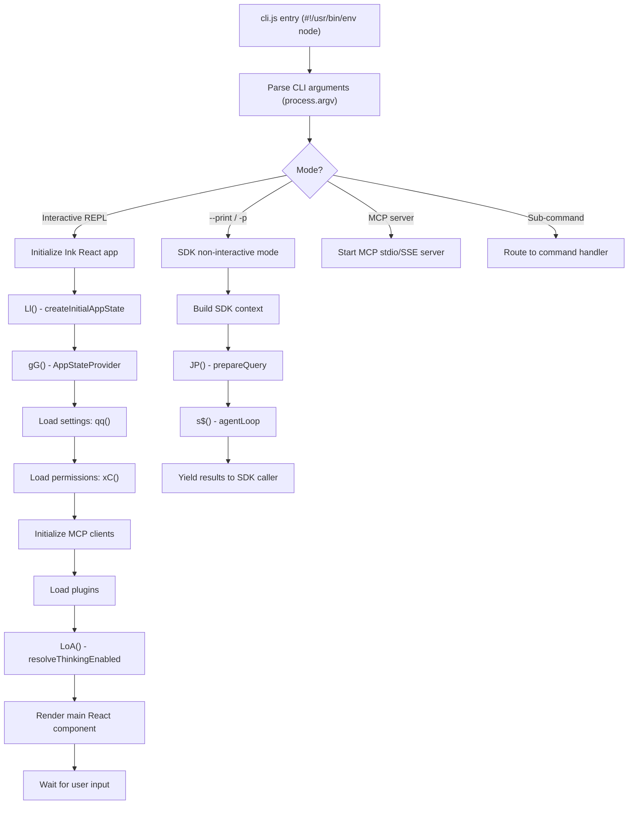
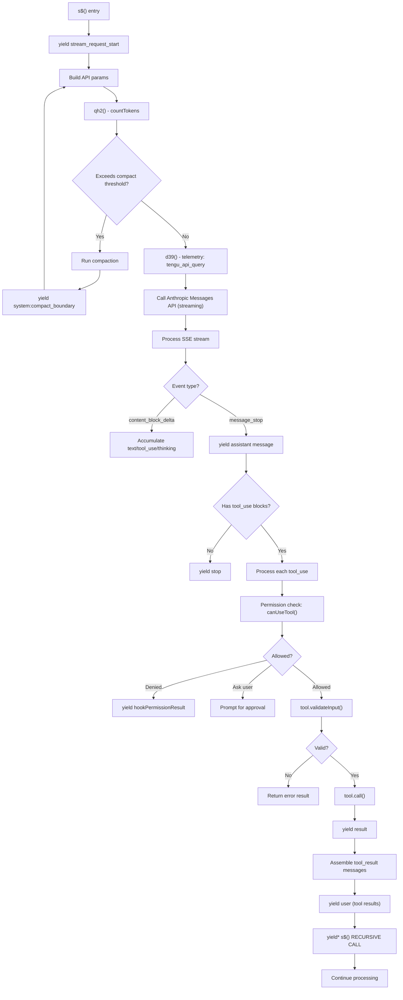
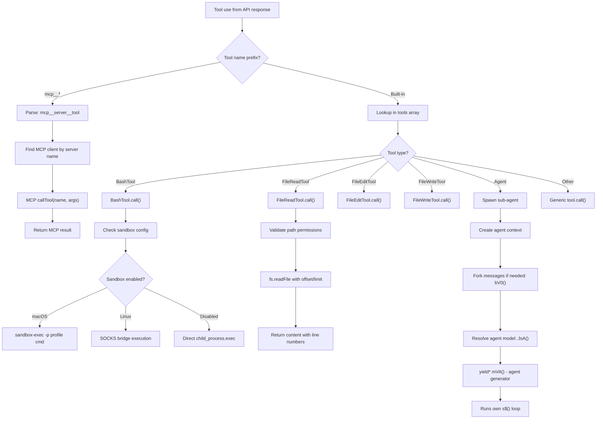
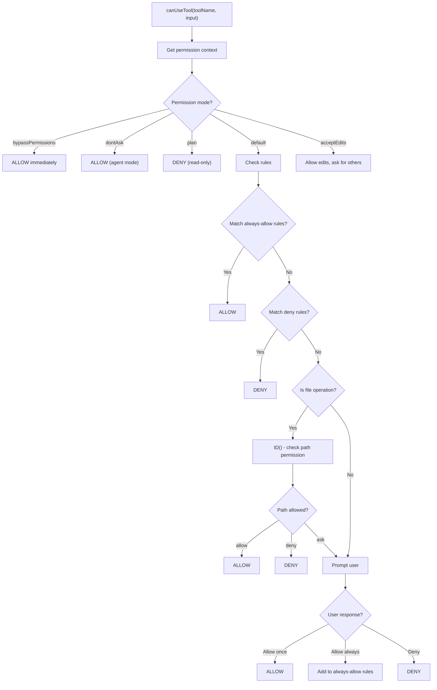
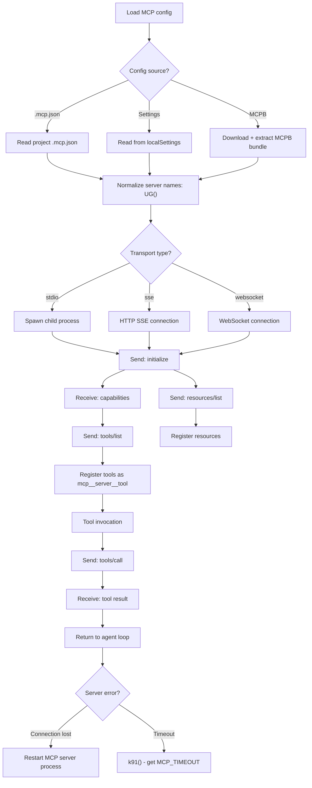
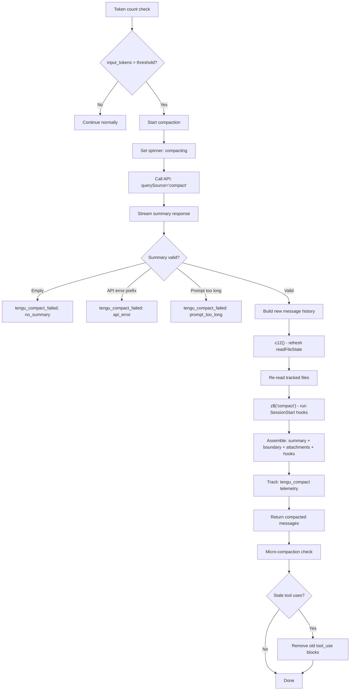
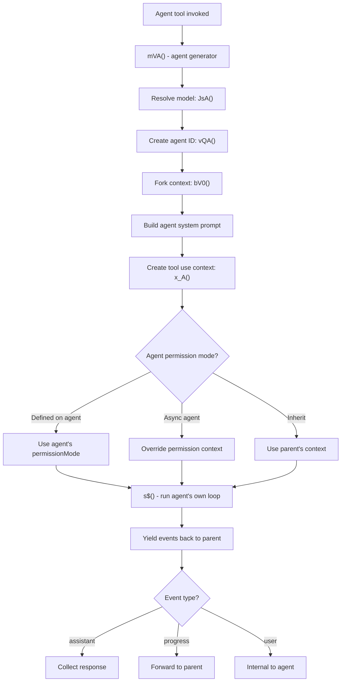

# 16 - Call Graphs

Call graphs traced from actual minified source patterns in `cli.js` (v2.0.62).
Function names shown as `minified` -> `reconstructedName`.

## 1. Main Boot Sequence



## 2. Agent Loop (s$ function)



## 3. Tool Dispatch Flow



## 4. Permission Check Flow



## 5. MCP Server Lifecycle



## 6. Compaction Flow



## 7. Sub-Agent Spawn Flow



## 8. Slash Command Dispatch

```
User types /<command>
  ├── Parse command name and args
  ├── Look up in commands array
  │   ├── /clear    → Clear conversation history
  │   ├── /compact  → Trigger manual compaction
  │   ├── /config   → Open config panel (React component)
  │   ├── /context  → Show context usage grid
  │   ├── /cost     → Show session cost/duration
  │   ├── /doctor   → Run diagnostics
  │   ├── /help     → Show help
  │   ├── /memory   → Edit CLAUDE.md files
  │   ├── /mcp      → Manage MCP servers
  │   ├── /model    → Switch model (YI1 component)
  │   ├── /plan     → View/open session plan
  │   ├── /resume   → Resume conversation
  │   ├── /review   → Review pull request
  │   ├── /status   → Show version, model, account info
  │   ├── /vim      → Toggle vim mode
  │   └── 30+ more commands
  ├── Execute command handler
  │   ├── Some return React components (config, context)
  │   ├── Some modify app state (model, vim)
  │   └── Some yield messages (compact, review)
  └── Return: {newMessages, contextModifier, allowedTools, model}
```
